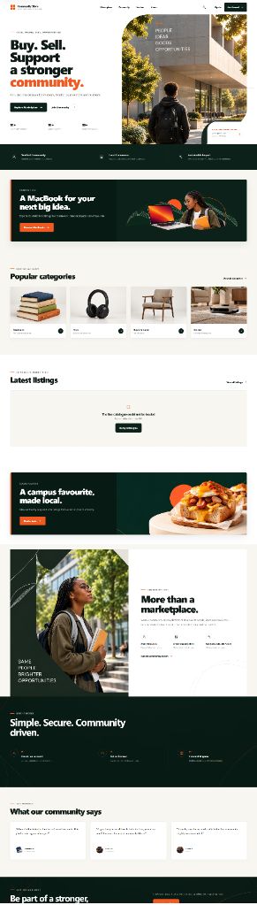
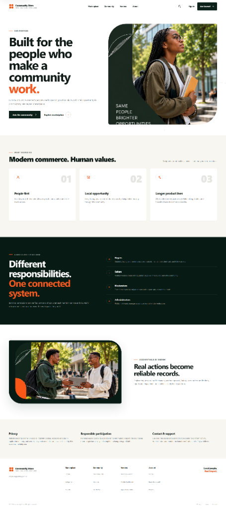
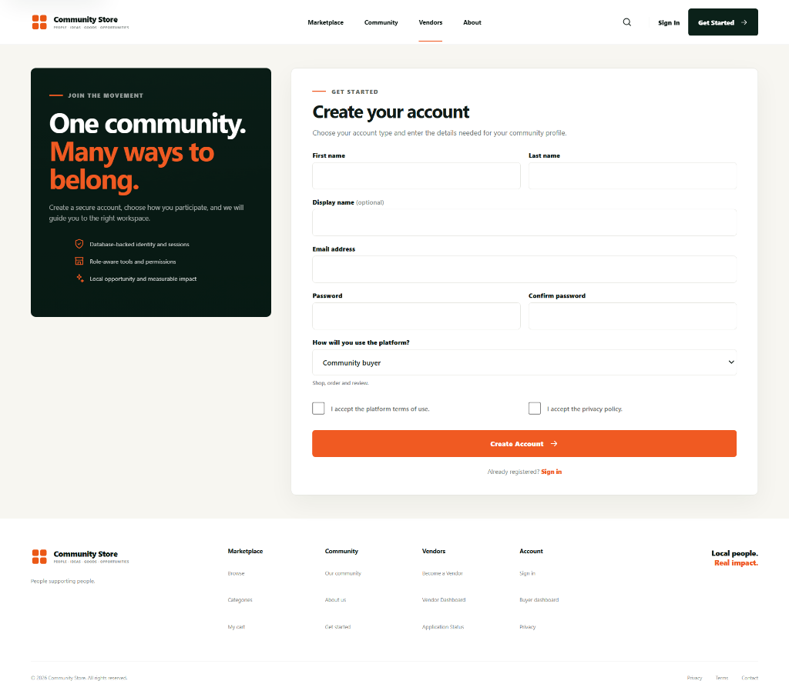
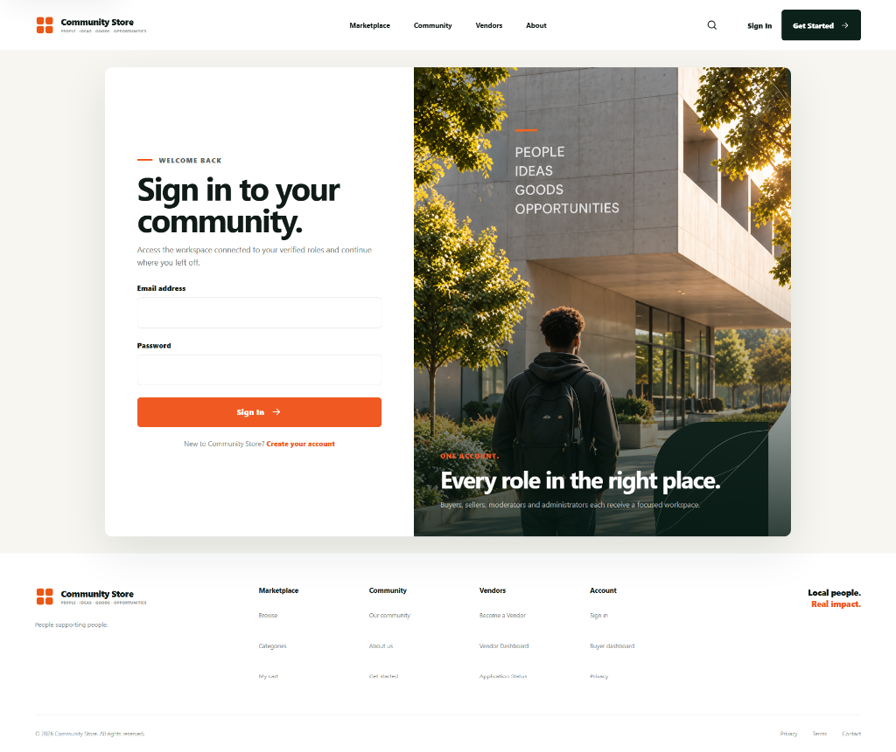

# Community Store

Community Store is a full-stack marketplace built to help people in a campus or local community buy, sell, share opportunities, and participate in community events. Members can browse products and services, become approved vendors, place orders, review purchases, receive notifications, and build trust through one shared platform.

## Main features

- Community marketplace for products and services
- Buyer cart, checkout, orders, reviews, and loyalty features
- Vendor applications, product listings, and fulfilment tools
- Community announcements, events, registration, and waitlists
- Role-based workspaces for buyers, sellers, moderators, and administrators
- Secure JWT authentication with refresh sessions
- Simulated payments and escrow for development and demonstration
- Responsive desktop, tablet, and mobile layouts

## Tech stack

| Layer | Technology |
|---|---|
| Frontend | React 19.1.1, React Router 7.18.3, Vite 7.3.6, CSS |
| Backend | Java 21, Spring Boot 4.1.1, Spring MVC, Spring Security |
| Data | Spring Data JPA, Hibernate, MySQL |
| Authentication | JWT access tokens and rotating refresh sessions |
| API | REST and JSON |
| Build tools | npm and Maven Wrapper |

## Run the application locally

### Prerequisites

Install the following before starting:

- [Java Development Kit 21](https://adoptium.net/)
- [MySQL](https://dev.mysql.com/downloads/)
- [Node.js 20.19+ or 22.12+](https://nodejs.org/)
- Git

### 1. Clone the repository

```powershell
git clone https://github.com/ngwanatiyani/UniMarketplatform.git
cd UniMarketplatform
```

### 2. Start the backend

Make sure MySQL is running. From the project root:

```powershell
cd backend

$env:JAVA_HOME = "C:\Program Files\Java\jdk-21" # Change this if Java is installed elsewhere.
$env:DB_USERNAME = "root"
$env:DB_PASSWORD = "your-mysql-password"
$env:DB_URL = "jdbc:mysql://localhost:3306/unimarket?createDatabaseIfNotExist=true&serverTimezone=UTC"

$bytes = New-Object byte[] 48
$random = [Security.Cryptography.RandomNumberGenerator]::Create()
try { $random.GetBytes($bytes) } finally { $random.Dispose() }
$env:UNIMARKET_JWT_SECRET = [Convert]::ToBase64String($bytes)

.\mvnw.cmd spring-boot:run
```

The API starts at `http://localhost:8080`.

> Keep passwords and secrets in environment variables. Do not commit them to Git.

### 3. Start the frontend

Open a second PowerShell terminal from the project root:

```powershell
cd frontend
npm ci
npm run dev
```

Open `http://localhost:5173` in your browser. During development, Vite forwards `/api` requests to the backend on port `8080`.

## User experience

The interface uses clear navigation, large editorial headings, simple cards, and strong calls to action. Marketplace content is balanced with community stories so the application feels useful and people-focused rather than like a generic online shop.

### Home and marketplace discovery

<p align="center">
  
</p>

The long-form homepage introduces the mission first, then guides visitors into categories and listings. Promotional panels, community photography, testimonials, and benefit sections create a natural path from discovery to participation.

### About the community

<table>
  <tr>
    <td width="50%"></td>
    
  </tr>
  <tr>
    <td align="center"><strong>Story-led concept</strong></td>
  </tr>
</table>

The About experience explains why the platform exists, who participates, and how each role contributes. Human photography keeps the message grounded in real community life, while numbered value cards and role summaries make the information easy to scan.

### Registration

<p align="center">
  
</p>

Registration combines a trust-focused introduction with a structured form. New members choose how they will use the platform, accept the required policies, and create one account that can later receive additional approved roles.

### Sign in

<p align="center">
  
</p>

The sign-in page keeps the main task focused on the left while using an aspirational community image on the right. The split layout reinforces the product identity without making authentication feel complicated.

## Colors and visual style

| Color | Hex | Use |
|---|---|---|
| Deep green | `#071A14` | Dark sections and high-contrast backgrounds |
| Community green | `#0B2119` | Navigation, buttons, panels, and brand identity |
| Soft green | `#153A2C` | Supporting green surfaces and details |
| Action orange | `#F05A22` | Primary calls to action, highlights, and active states |
| Dark orange | `#D94612` | Stronger orange emphasis and hover states |
| Cream | `#F7F6F1` | Warm page sections and soft visual separation |
| Ink | `#101B17` | Main headings and body text |
| Muted gray | `#69716E` | Secondary text and descriptions |
| Border gray | `#E4E5DF` | Form fields, cards, and subtle dividers |
| White | `#FFFFFF` | Cards, forms, and open content areas |

Dark green communicates trust, stability, and community. Orange adds warmth, energy, and visibility to important actions. Cream and white provide breathing room, while near-black green text keeps the interface softer than pure black. The primary font stack uses Inter, Avenir, Segoe UI, Helvetica, and Arial.

## Project structure

```text
UniMarketplatform/
├── backend/             # Spring Boot REST API
├── frontend/            # React and Vite application
├── docs/screenshots/    # UX images used in this README
├── LICENSE
└── README.md
```

For backend API and seed-data details, see [`backend/README.md`](backend/README.md) and [`backend/SEEDING.md`](backend/SEEDING.md).

## License

This project is distributed under the terms in [LICENSE](LICENSE).
