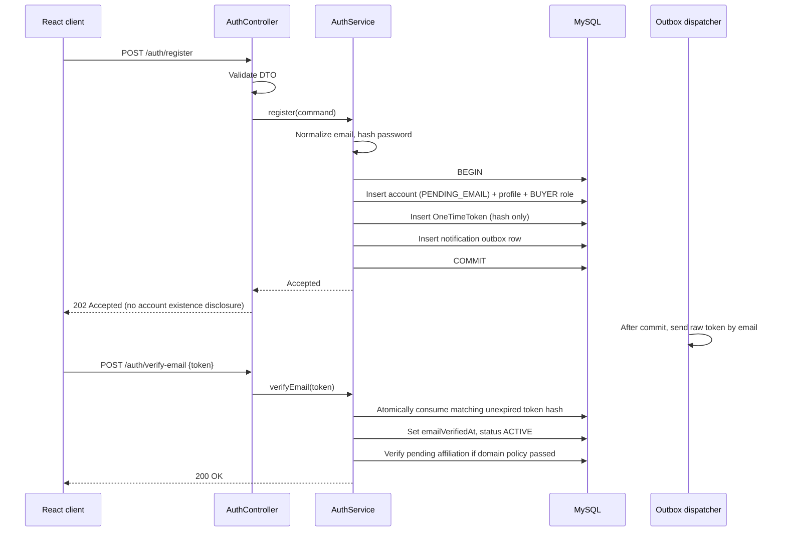
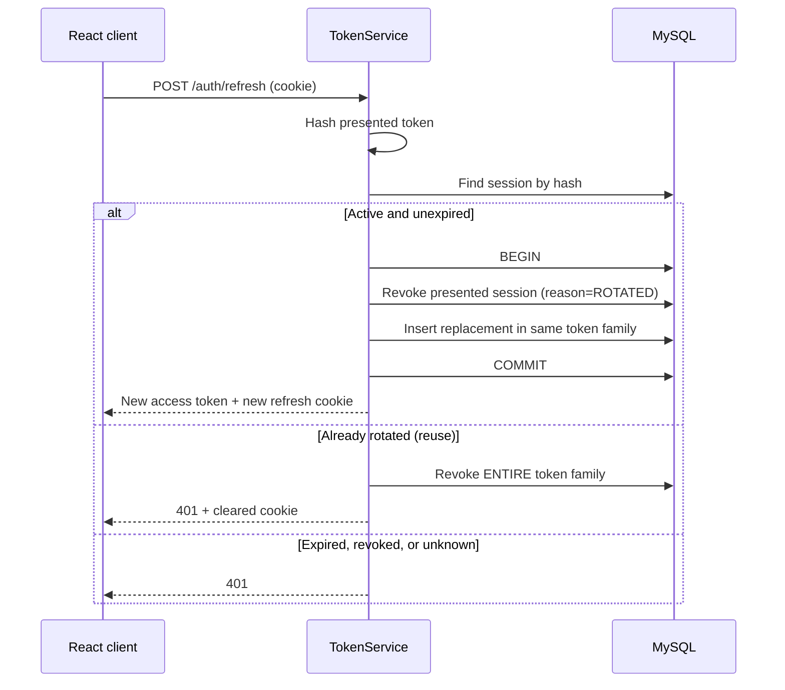

# Design Document

## Overview

This document describes how the UniMarket backend satisfies the 21 requirements in `requirements.md`. It defines the architecture, dependency changes, security design, component interfaces, transaction and concurrency strategy, error taxonomy, migration approach, and test strategy.

The entity attribute tables, column types, and the entity-relationship diagram live in `README.md` and are not duplicated here. This document instead specifies the behaviour, boundaries, and interfaces that operate on those structures, and traces each design decision back to a numbered requirement.

### Design goals

1. **Correct before clever.** Concurrency, money, and identity correctness take priority over feature count.
2. **Trust is earned, never declared.** No self-selected field grants a badge or a privilege.
3. **Secrets never rest in the repository.** Configuration is externalised from the first commit.
4. **Boundaries now, services later.** Bounded contexts are explicit so extraction stays possible without a data model rewrite.
5. **No real financial data, ever.** The simulated payment boundary is a hard architectural constraint, not a UI convention.

### Key design decisions

| Decision | Choice | Rationale | Requirements |
|---|---|---|---|
| Deployment shape | Modular monolith | A student team cannot absorb distributed transactions, service discovery, and multi-service observability in one semester while also delivering the marketplace | 21.1–21.5 |
| Token strategy | Short-lived asymmetric JWT + opaque rotated refresh token | Stateless authorization with a server-side revocation point | 2.4, 3.1–3.9 |
| Refresh transport | `Secure` `HttpOnly` cookie | Refresh material is unreadable to JavaScript, limiting XSS impact | 3.2, 19.4 |
| Access token storage | React memory only | Avoids `localStorage` token theft | 2.10 |
| Password hashing | BCrypt via `PasswordEncoder` | Adaptive, salted, available in Spring Security, familiar to markers | 1.4, 2.2 |
| Identity vs. permission vs. trust | Three separate models | One `userType` column cannot express "student who also sells" | 5.1–5.9, 7.3 |
| Institution email policy | Database-driven with evidence | University conventions change and several are undocumented | 6.1–6.10 |
| Business verification | Manual moderator review | No CIPC API access is assumed for the MVP | 9.3, 9.11 |
| Schema management | Flyway migrations, Hibernate `validate` | Reproducible schema for every team member and marker | 18.10, 18.11 |
| Oversell prevention | Atomic conditional update | A read-then-write check loses under concurrency | 10.9 |
| Order history | Immutable snapshots | Editing a listing must not rewrite a past sale | 11.8, 11.9 |
| Payment | Internal simulation, scenario token only | Removes all cardholder data from scope | 12.1–12.3 |

## Architecture

### Layered flow

```text
HTTP request
    ↓
Controller            ── HTTP concerns only: routing, status codes, DTO binding
    ↓
Request DTO           ── Jakarta Bean Validation
    ↓
Application Service   ── transaction boundary, authorization, orchestration
    ↓
Domain / Factory      ── invariants, state machines, aggregate construction
    ↓
Repository            ── persistence via Spring Data JPA
    ↓
MySQL
```

Rules enforced by review:

- Controllers contain no business rules and no repository calls.
- Services own the `@Transactional` boundary; controllers never open transactions.
- JPA entities never cross the HTTP boundary; controllers return response DTOs only (Requirement 19.8).
- Factories construct valid aggregates; they are not a home for unrelated static helpers.
- Because `spring.jpa.open-in-view=false` is already set, every field needed for a response must be initialised inside the transactional service or fetched by an explicit query or projection. Mapping after the transaction closes would throw a lazy-initialisation error.

### Bounded contexts

| Context | Responsibility | Primary aggregates |
|---|---|---|
`identity` | Credentials, roles, sessions, tokens, addresses | `UserAccount` |
`verification` | Institutions, email domain policy, affiliations, seller and business verification | `Institution`, `SellerProfile`, `VerificationCase` |
`catalog` | Categories, listings, images, inventory | `Listing` |
`cart` | Active cart and cart items | `Cart` |
`order` | Checkout orders, seller orders, order items, fulfilment | `CheckoutOrder` |
`payment` | Simulated payment attempts and outcomes | `PaymentSimulation` |
`reputation` | Verified-purchase reviews and rating projections | `Review` |
`community` | Bulletin posts | `BulletinPost` |
`notification` | Notifications and the outbox dispatcher | `Notification` |
`moderation` | Reports, moderation actions, fraud assessments, audit events | `Report`, `AuditEvent` |

Cross-context coordination happens through application services and outbox records, never through a controller mutating several repositories in sequence.

### Package structure

```text
com.example.unimarket
├── UniMarketApplication.java
├── config
│   ├── SecurityConfig.java            # SecurityFilterChain, authorization rules
│   ├── JwtConfig.java                 # JwtEncoder, JwtDecoder, key loading
│   ├── PasswordEncoderConfig.java     # BCryptPasswordEncoder
│   ├── CorsConfig.java                # explicit origin allowlist
│   ├── JpaAuditingConfig.java         # auditing + UTC clock
│   └── properties                     # @ConfigurationProperties records
├── controller
│   ├── auth · account · verification · catalog
│   ├── cart · checkout · payment · order
│   └── review · community · moderation · admin
├── domain
│   ├── common                         # AuditableEntity, Money, enums
│   ├── identity · verification · catalog · cart
│   ├── order · payment · reputation
│   └── community · notification · moderation
├── factory                            # aggregate factories per context
├── repository                         # Spring Data interfaces per context
├── request                            # inbound DTOs, validated
├── response                           # outbound DTOs
├── service
│   ├── (interfaces: IAuthService, ITokenService, ...)
│   └── impl                           # @Service implementations
└── util                               # EmailNormalizer, TokenHasher, OrderNumberGenerator
```

Two corrections to the current skeleton (Requirement 20.9):

1. Rename `until` to `util`.
2. Make `AuthServiceImpl` actually declare `implements IAuthService` and annotate it `@Service`. Today the interface is empty and the implementation is an unrelated empty class, so no bean exists.

The existing `IAuthService` naming convention is retained for consistency, even though plain `AuthService` is more idiomatic in modern Java. Consistency inside one codebase matters more than the convention debate.

## Dependency configuration

The backend uses Maven. `pom.xml` is authoritative and inherits dependency and plugin management from `spring-boot-starter-parent` 4.1.1. The Maven conversion preserves the previously working dependency set rather than introducing unrelated framework changes.

```xml
<dependencies>
    <dependency>
        <groupId>org.springframework.boot</groupId>
        <artifactId>spring-boot-starter-data-jpa</artifactId>
    </dependency>
    <dependency>
        <groupId>org.springframework.boot</groupId>
        <artifactId>spring-boot-starter-security</artifactId>
    </dependency>
    <dependency>
        <groupId>org.springframework.boot</groupId>
        <artifactId>spring-boot-starter-security-oauth2-client</artifactId>
    </dependency>
    <dependency>
        <groupId>org.springframework.boot</groupId>
        <artifactId>spring-boot-starter-security-oauth2-resource-server</artifactId>
    </dependency>
    <dependency>
        <groupId>org.springframework.boot</groupId>
        <artifactId>spring-boot-starter-validation</artifactId>
    </dependency>
    <dependency>
        <groupId>org.springframework.boot</groupId>
        <artifactId>spring-boot-starter-webmvc</artifactId>
    </dependency>
    <dependency>
        <groupId>com.mysql</groupId>
        <artifactId>mysql-connector-j</artifactId>
        <scope>runtime</scope>
    </dependency>
</dependencies>
```

Notes:

- OAuth2 Resource Server supplies the JWT issuing and validation APIs used by `JwtEncoder` and `JwtDecoder`.
- OAuth2 Client remains on the classpath to preserve the established build contract. Removing it is a separate application-level decision, not part of the build-tool migration.
- Request records use Jakarta Bean Validation through `spring-boot-starter-validation`.
- Spring Boot 4 uses the `jakarta.*` namespace. Entity and validation imports must use `jakarta.persistence` and `jakarta.validation`.
- Build and test the pinned Spring Boot/Maven/JDK 21 combination with `./mvnw clean verify`. Maven output belongs under `target/`.

## Configuration design

### Externalised properties

```properties
spring.application.name=UniMarket

# Datasource (Requirement 20.1, 20.2)
spring.datasource.url=${DB_URL}
spring.datasource.username=${DB_USERNAME}
spring.datasource.password=${DB_PASSWORD}

# Schema ownership (Requirement 18.10, 18.11)
spring.jpa.hibernate.ddl-auto=validate
spring.flyway.enabled=true
spring.flyway.locations=classpath:db/migration
spring.jpa.open-in-view=false
spring.jpa.properties.hibernate.jdbc.time_zone=UTC

# Tokens (Requirements 2.4-2.6, 3.1-3.2, 20.3, 20.4)
unimarket.security.jwt.issuer=${JWT_ISSUER}
unimarket.security.jwt.audience=${JWT_AUDIENCE}
unimarket.security.jwt.private-key-location=${JWT_PRIVATE_KEY}
unimarket.security.jwt.public-key-location=${JWT_PUBLIC_KEY}
unimarket.security.jwt.access-token-ttl=PT15M
unimarket.security.refresh.ttl=P7D
unimarket.security.refresh.cookie-name=unimarket_rt

# Browser integration (Requirement 19.1, 19.2)
unimarket.security.cors.allowed-origins=${FRONTEND_ORIGINS}

# One-time tokens (Requirements 1.6, 4.2)
unimarket.security.one-time-token.verify-email-ttl=PT30M
unimarket.security.one-time-token.reset-password-ttl=PT15M

# Abuse controls (Requirements 2.1, 2.9, 19.7)
unimarket.security.lockout.max-failed-attempts=5
unimarket.security.lockout.duration=PT15M
```

Every property above is bound to a `@ConfigurationProperties` record with `@Validated`, so a missing issuer or key fails startup with a clear message rather than silently defaulting (Requirement 20.5).

The committed `application.properties` reads datasource credentials from `DB_USERNAME` and `DB_PASSWORD`; no database password is stored in source control. Developers must provide `DB_PASSWORD` through their local environment or another external secret source.

### Profiles

| Profile | Datasource | Keys | Notes |
|---|---|---|---|
`local` | Developer MySQL via env vars | Locally generated dev keypair | `spring.jpa.show-sql` may be enabled |
`test` | Isolated test schema or Testcontainers | Fixed committed **test-only** keypair | Deterministic clock for token expiry tests |
`prod` | Managed instance, least-privilege user | Secret manager reference | Debug endpoints and SQL logging disabled |

The `test` profile must not require a developer's personal database, so the generated context test stops depending on a reachable local MySQL instance (Requirement 20.7).

## Security design

### Filter chain

`SecurityConfig` replaces Spring Boot's default auto-configured security. Without it, the framework generates a random development user and protects everything by convention, which is unrelated to the account model.

```java
@Bean
SecurityFilterChain apiFilterChain(HttpSecurity http, JwtDecoder decoder) throws Exception {
    return http
        .securityMatcher("/api/**")
        .cors(cors -> cors.configurationSource(corsConfigurationSource()))
        .csrf(csrf -> csrf.ignoringRequestMatchers("/api/v1/auth/login", "/api/v1/auth/register"))
        .sessionManagement(s -> s.sessionCreationPolicy(SessionCreationPolicy.STATELESS))
        .authorizeHttpRequests(auth -> auth
            .requestMatchers(HttpMethod.POST,
                "/api/v1/auth/register",
                "/api/v1/auth/login",
                "/api/v1/auth/refresh",
                "/api/v1/auth/verify-email",
                "/api/v1/auth/forgot-password",
                "/api/v1/auth/reset-password").permitAll()
            .requestMatchers(HttpMethod.GET,
                "/api/v1/listings/**",
                "/api/v1/categories/**",
                "/api/v1/bulletin/**").permitAll()
            .requestMatchers("/api/v1/admin/**").hasRole("ADMIN")
            .requestMatchers("/api/v1/moderation/**").hasAnyRole("MODERATOR", "ADMIN")
            .requestMatchers("/api/v1/seller/**").hasRole("SELLER")
            .anyRequest().authenticated())
        .oauth2ResourceServer(oauth -> oauth.jwt(jwt -> jwt.decoder(decoder)))
        .exceptionHandling(ex -> ex
            .authenticationEntryPoint(problemAuthenticationEntryPoint())   // 401
            .accessDeniedHandler(problemAccessDeniedHandler()))            // 403
        .build();
}
```

Design notes:

- Stateless session management satisfies Requirement 19.3.
- The 401 versus 403 split is explicit, because Spring's defaults do not reliably distinguish them (Requirement 5.8).
- `/api/v1/auth/refresh` is public at the filter level because the caller presents a cookie rather than a bearer token; the refresh service performs its own validation.
- CSRF handling deserves care: the refresh endpoint is cookie-authenticated, so it is a state-changing cookie endpoint. The chosen mitigation is `SameSite=Strict` on the refresh cookie plus a required custom header that a cross-site form post cannot set. If the frontend is later served from a different site context, this decision must be revisited (Requirement 19.4).
- Role checks use `hasRole`, so authorities are stored with the `ROLE_` prefix during token conversion.

### JWT configuration

```java
@Bean
JwtEncoder jwtEncoder(RSAPrivateKey privateKey, RSAPublicKey publicKey) {
    var jwk = new RSAKey.Builder(publicKey).privateKey(privateKey).keyID(activeKeyId).build();
    return new NimbusJwtEncoder(new ImmutableJWKSet<>(new JWKSet(jwk)));
}

@Bean
JwtDecoder jwtDecoder(RSAPublicKey publicKey, JwtProperties props) {
    var decoder = NimbusJwtDecoder.withPublicKey(publicKey)
        .signatureAlgorithm(SignatureAlgorithm.RS256)
        .build();
    decoder.setJwtValidator(new DelegatingOAuth2TokenValidator<>(
        JwtValidators.createDefaultWithIssuer(props.issuer()),
        new JwtClaimValidator<List<String>>("aud", aud -> aud.contains(props.audience()))));
    return decoder;
}
```

Pinning the signature algorithm on the decoder prevents algorithm-substitution attacks. Issuer and audience are validated explicitly, satisfying Requirement 2.7.

### Access token claims

| Claim | Source | Purpose |
|---|---|---|
`iss` / `aud` | Configuration | Reject tokens minted for another environment |
`sub` | `UserAccount.id` | Principal identity |
`sid` | `AuthSession.tokenFamilyId` | Correlates an access token to a revocable session |
`jti` | Generated UUID | Unique token identity for audit |
`iat` / `nbf` / `exp` | Clock + TTL | Standard validity window |
`roles` | Active role assignments | Authorization decisions |
`email_verified` | `emailVerifiedAt != null` | Cheap gate for verified-only endpoints |

Excluded deliberately: addresses, student numbers, business registration data, ratings, and display names. All are mutable, and a stale token would carry outdated values (Requirement 2.6). The `sid` claim exists so that a future revocation check can correlate a presented access token with a revoked session family.

### Registration and verification sequence



The token row is written inside the same transaction as the account, while the email is sent only after commit. Sending during the transaction risks delivering a token for an account that later rolls back (Requirement 15.6).

Token consumption uses a single conditional update rather than a read-then-update, so two concurrent submissions of the same token cannot both succeed:

```java
@Modifying
@Query("""
    update OneTimeToken t set t.consumedAt = :now
    where t.tokenHash = :hash and t.purpose = :purpose
      and t.consumedAt is null and t.expiresAt > :now
    """)
int consume(String hash, TokenPurpose purpose, Instant now);
```

A return value of `1` means this caller won the race; `0` means expired, already used, or unknown, and all three produce one indistinguishable response (Requirement 1.9).

### Refresh rotation and reuse detection



Reuse detection is the security value of rotation. A refresh token presented after it was already exchanged indicates either theft or a client bug; both warrant invalidating the whole family and forcing re-authentication (Requirement 3.4). Rotation happens in one transaction so a crash mid-rotation cannot leave two valid tokens.

Refresh is additionally denied when the account is not `ACTIVE`, or when `credentialsChangedAt` is later than the session's issue time. This closes the window where a password change would otherwise leave older sessions usable (Requirements 3.8, 3.9).

### Cookie attributes

```java
ResponseCookie.from(props.cookieName(), rawRefreshToken)
    .httpOnly(true)
    .secure(true)
    .sameSite("Strict")
    .path("/api/v1/auth")
    .maxAge(props.refreshTtl())
    .build();
```

The narrow path means the refresh token is not transmitted with ordinary API calls, reducing exposure (Requirements 3.2, 19.4).

### Enumeration and timing defences

Registration with an existing address and password reset for an unknown address both return the same shape as the success case (Requirements 1.7, 4.1). Login returns one generic failure for bad credentials, unknown accounts, locked accounts, and suspended accounts (Requirement 2.3).

To avoid a timing oracle when the email is unknown, the login path still performs a BCrypt comparison against a dummy hash before failing, so response time does not reveal account existence.

### Lockout

Failed attempts increment a counter; crossing the configured threshold sets `lockedUntil`. While the lock is active, authentication is denied even with correct credentials, and the generic failure response is unchanged so an attacker learns nothing (Requirements 2.9, 2.3). A successful login resets the counter. Lockout state is also an input to fraud assessment (Requirement 16.8).

## Components and interfaces

Service interfaces are declared in `service` and implemented in `service.impl` with constructor injection. Signatures below use command and result records rather than entities, so no aggregate leaks across a boundary.

### Identity

```java
public interface IAuthService {
    RegistrationResult register(RegisterCommand command);
    void verifyEmail(String rawToken);
    void resendVerification(String email);
    AuthResult login(LoginCommand command, RequestContext context);
    void requestPasswordReset(String email);
    void resetPassword(ResetPasswordCommand command);
    void changePassword(UUID userId, ChangePasswordCommand command);
}

public interface ITokenService {
    AccessToken issueAccessToken(UserAccount account);
    IssuedRefreshToken issueRefreshToken(UserAccount account, RequestContext context);
    RefreshResult rotate(String rawRefreshToken, RequestContext context);
    void revokeSession(String rawRefreshToken, RevocationReason reason);
    void revokeAllSessions(UUID userId, RevocationReason reason);
    List<SessionSummary> listSessions(UUID userId);
}

public interface IOneTimeTokenService {
    String issue(UUID userId, TokenPurpose purpose);
    UUID consumeOrThrow(String rawToken, TokenPurpose purpose);
}

public interface IRoleService {
    void grant(UUID userId, Role role, UUID grantedByUserId);
    void revoke(UUID userId, Role role, UUID revokedByUserId);
    Set<Role> activeRoles(UUID userId);
}
```

`ITokenService.rotate` returns both a new access token and a new refresh token, because rotation must be atomic and callers should not be able to perform half of it.

### Verification

```java
public interface IInstitutionService {
    Optional<DomainMatch> matchEmailDomain(String normalizedEmail);
    Institution create(CreateInstitutionCommand command);
    void activateDomain(UUID domainId, DomainEvidence evidence);   // requires source + checked date
}

public interface IAffiliationService {
    AffiliationResult claim(UUID userId, String institutionalEmail);
    void confirm(String rawToken);
    void expireLapsedAffiliations(Instant asOf);
}

public interface ISellerService {
    SellerProfile createProfile(UUID userId, CreateSellerProfileCommand command);
    void submitForReview(UUID sellerProfileId);
    void suspend(UUID sellerProfileId, String reason, UUID moderatorId);
}

public interface IBusinessVerificationService {
    VerificationCase submit(UUID sellerProfileId, SubmitBusinessVerificationCommand command);
    void attachDocument(UUID caseId, DocumentUpload upload);
    void approve(UUID caseId, UUID moderatorId);
    void reject(UUID caseId, UUID moderatorId, String reason);   // reason mandatory
}
```

`matchEmailDomain` returns the matched domain plus its enforcement mode, so the caller can distinguish "verified automatically", "route to manual review", and "no match" (Requirements 6.5, 6.6).

`IInstitutionService.activateDomain` requires evidence as a parameter rather than accepting a bare boolean, making Requirement 6.10 impossible to bypass accidentally.

### Catalog and commerce

```java
public interface IListingService {
    Listing create(UUID sellerProfileId, CreateListingCommand command);
    Listing update(UUID listingId, UUID actorUserId, UpdateListingCommand command);
    void publish(UUID listingId, UUID actorUserId);
    void archive(UUID listingId, UUID actorUserId);
    Page<ListingSummary> search(ListingSearchCriteria criteria, Pageable pageable);
}

public interface IInventoryService {
    void reserve(UUID listingId, int quantity);     // atomic; throws InsufficientStockException
    void release(UUID listingId, int quantity);
    void confirmConsumption(UUID listingId, int quantity);
}

public interface ICartService {
    CartView addItem(UUID buyerUserId, AddCartItemCommand command);
    CartView updateQuantity(UUID buyerUserId, UUID cartItemId, int quantity);
    CartView removeItem(UUID buyerUserId, UUID cartItemId);
    CartValidationReport validate(UUID buyerUserId);   // re-reads authoritative state
}

public interface ICheckoutService {
    CheckoutResult checkout(UUID buyerUserId, CheckoutCommand command);
}

public interface IPaymentSimulationService {
    PaymentResult simulate(UUID buyerUserId, SimulatePaymentCommand command);  // idempotent
    void refund(UUID paymentId, UUID actorUserId, String reason);
}

public interface IFulfilmentService {
    void advance(UUID sellerOrderId, UUID actorUserId, FulfilmentStatus target);
    void confirmReceipt(UUID sellerOrderId, UUID buyerUserId);
}
```

`ICartService.validate` is public rather than private because the client should be able to surface price and stock problems before the buyer commits to checkout (Requirement 11.5).

### Trust and platform

```java
public interface IReviewService {
    Review create(UUID reviewerUserId, CreateReviewCommand command);   // requires fulfilled order item
    void respond(UUID reviewId, UUID sellerUserId, String response);
}

public interface IModerationService {
    Report submitReport(UUID reporterUserId, SubmitReportCommand command);
    void act(UUID moderatorId, ModerationActionCommand command);       // reason mandatory
}

public interface IFraudAssessmentService {
    FraudDecision assess(FraudSubject subject);
    void recordReview(UUID assessmentId, UUID moderatorId, ReviewOutcome outcome);
}

public interface INotificationService {
    void enqueue(UUID recipientUserId, NotificationType type, NotificationPayload payload);
}

public interface IAuditService {
    void record(AuditEventCommand command);   // allowlisted metadata only
}
```

### Repository highlights

Beyond standard CRUD, these queries carry design significance:

```java
// Longest-suffix domain match on a label boundary (Requirement 6.5)
@Query("""
    select d from InstitutionEmailDomain d
    where d.active = true
      and (:emailDomain = d.domain or :emailDomain like concat('%.', d.domain))
    order by length(d.domain) desc
    """)
List<InstitutionEmailDomain> findMatchingDomains(String emailDomain);

// Atomic reservation; prevents oversell without pessimistic locks (Requirement 10.9)
@Modifying
@Query("""
    update Inventory i
    set i.quantityReserved = i.quantityReserved + :qty
    where i.listingId = :listingId
      and i.quantityAvailable - i.quantityReserved >= :qty
    """)
int tryReserve(UUID listingId, int qty);

// Verified-purchase gate (Requirement 14.1)
@Query("""
    select count(oi) > 0 from OrderItem oi
      join oi.sellerOrder so
      join so.checkoutOrder co
    where oi.id = :orderItemId
      and co.buyerUserId = :userId
      and so.status = 'FULFILLED'
    """)
boolean isReviewable(UUID orderItemId, UUID userId);
```

The domain match uses `like concat('%.', d.domain)` specifically so that `fake-myuct.ac.za` does not match `myuct.ac.za` — only a true subdomain boundary matches. A naive `like '%' || domain` would accept the lookalike.

`tryReserve` returning `0` means insufficient stock at the moment of the attempt. The check and the write are one statement, so the database arbitrates the race rather than the application.

## Data model notes

Attribute-level tables are in `README.md`. This section records only the decisions that constrain implementation.

### Base entity

```java
@MappedSuperclass
public abstract class AuditableEntity {
    @Id
    @Column(columnDefinition = "BINARY(16)")
    private UUID id = UUID.randomUUID();

    @CreatedDate  @Column(nullable = false, updatable = false)
    private Instant createdAt;

    @LastModifiedDate @Column(nullable = false)
    private Instant updatedAt;

    @Version
    private Long version;
}
```

UUIDs are application-generated so an aggregate is fully identified before persistence, which simplifies factories and outbox correlation. `BINARY(16)` avoids the storage and index cost of a 36-character string. `@Version` provides optimistic locking on account, seller, listing, inventory, cart, and order aggregates (Requirement 18.1).

### Money

Money is `DECIMAL(19,2)` with a separate `CHAR(3)` currency, wrapped in a `Money` value object that refuses cross-currency arithmetic. Floating-point types are prohibited (Requirement 10.3). The MVP is `ZAR`-only, but the currency column exists so a later change is additive rather than a migration of every monetary column.

### State machines

Transitions are validated inside the aggregate, never accepted from a request body (Requirement 12.8).

```text
PaymentSimulation:
  INITIATED  -> PROCESSING -> SUCCEEDED -> REFUNDED
  INITIATED  -> PROCESSING -> FAILED
  INITIATED  -> CANCELLED

CheckoutOrder:
  PENDING_PAYMENT -> PAID -> PARTIALLY_FULFILLED -> COMPLETED
  PENDING_PAYMENT -> PAYMENT_FAILED
  PENDING_PAYMENT -> CANCELLED

SellerOrder:
  AWAITING_PAYMENT -> CONFIRMED -> READY_FOR_PICKUP  -> FULFILLED
  AWAITING_PAYMENT -> CONFIRMED -> OUT_FOR_DELIVERY  -> FULFILLED
  CONFIRMED -> CANCELLED
  FULFILLED -> DISPUTED
```

Each aggregate exposes `canTransitionTo(target)` and throws `IllegalStateTransitionException` otherwise.

### Snapshots

`OrderItem` copies title, listing type, unit price, quantity, line total, condition, and primary image key at purchase time; `SellerOrder` copies the seller display name; `CheckoutOrder` copies the delivery address. `OrderItem.listingId` is nullable so a listing purged under a future retention policy cannot orphan order history (Requirements 11.8, 11.9).

This intentionally duplicates data. Normalising it away would mean a seller renaming a listing or lowering a price silently rewrites past invoices.

## Concurrency and transactions

| Scenario | Risk | Mitigation | Requirement |
|---|---|---|---|
Two buyers, last unit | Oversell | Single atomic conditional `UPDATE`; `0` rows means fail | 10.9 |
Same refresh token twice | Duplicate valid sessions | Rotation in one transaction; reuse revokes family | 3.3, 3.4 |
Payment webhook or retry replay | Double charge or double stock decrement | Unique idempotency key; replay returns original result | 12.5 |
Concurrent registration, same email | Two accounts | Unique index on normalised email; catch violation | 18.3, 18.4 |
Concurrent one-time token submit | Token used twice | Conditional `UPDATE ... WHERE consumedAt IS NULL` | 1.8 |
Concurrent edits to one listing | Lost update | `@Version` optimistic lock, retry or 409 | 18.1 |
Email send fails after commit | Rolled-back business transaction | Outbox row committed with transaction, dispatched after | 15.6 |

Transaction rules:

- Services own boundaries; `@Transactional(readOnly = true)` for queries.
- No remote call, email send, or file upload to object storage occurs inside a database transaction.
- Idempotent operations write the key first, so a uniqueness violation is the concurrency signal.
- Checkout runs as one transaction covering order creation, snapshot writing, and stock reservation, so a partial order cannot survive a failure.

## Error handling

A single `@RestControllerAdvice` maps exceptions to RFC 9457 problem responses. No stack trace, SQL, or internal class name reaches a client (Requirement 19.5).

```json
{
  "type": "https://unimarket.example/problems/insufficient-stock",
  "title": "Insufficient stock",
  "status": 409,
  "detail": "Only 2 units remain for this listing.",
  "instance": "/api/v1/checkout",
  "correlationId": "0f5c...",
  "errors": [{ "field": "items[0].quantity", "message": "Requested 5, available 2" }]
}
```

| Exception | Status | Notes |
|---|---|---|
`MethodArgumentNotValidException` | 400 | Field-level messages, no submitted password echoed |
`AuthenticationException` | 401 | One generic message for all credential failures |
`InvalidRefreshTokenException` | 401 | Clears the refresh cookie |
`AccessDeniedException` | 403 | Authenticated but not permitted |
`EmailNotVerifiedException` | 403 | Distinct code so the client can prompt for resend |
`ResourceNotFoundException` | 404 | Also used where existence itself is sensitive |
`IllegalStateTransitionException` | 409 | Invalid order, payment, or fulfilment transition |
`InsufficientStockException` | 409 | Includes remaining quantity |
`OptimisticLockingFailureException` | 409 | Client may retry |
`DuplicateResourceException` | 409 | Never used on the public registration path |
`RateLimitExceededException` | 429 | Includes `Retry-After` |
`MalwareDetectedException` | 422 | Upload rejected |
Everything else | 500 | Correlation ID logged; no internals exposed |

Every response carries the correlation ID that also appears on the matching audit event, so a member's support report can be traced without exposing internals (Requirement 17.3).

The `errors` array deliberately never echoes the submitted password value, even on a validation failure (Requirement 19.9).

## Database migrations

Flyway owns the schema; Hibernate only validates it. Ordering respects foreign keys.

| Version | Contents |
|---|---|
`V1` | Extensions, conventions, `institution`, `institution_email_domain` |
`V2` | `user_account`, `user_profile`, `user_role_assignment`, `user_address` |
`V3` | `auth_session`, `one_time_token`, `login_attempt` |
`V4` | `institutional_affiliation` |
`V5` | `seller_profile`, `business_profile`, `verification_case`, `verification_document` |
`V6` | `category`, `listing`, `listing_fulfilment_option`, `listing_image`, `inventory` |
`V7` | `cart`, `cart_item` |
`V8` | `checkout_order`, `seller_order`, `order_item`, `fulfilment` |
`V9` | `payment_simulation` |
`V10` | `review` |
`V11` | `bulletin_post`, `notification`, `notification_outbox` |
`V12` | `report`, `moderation_action`, `fraud_assessment`, `audit_event` |
`V13` | Seed reference data: categories, institutions, email domains |

`V13` seeds the 13 evidenced institutions as active with their source URL and check date, and the 13 unconfirmed institutions as **inactive** (Requirements 6.7, 6.8). Seeds are idempotent so re-running against an existing database is safe.

Rules: migrations are never edited once merged; corrections ship as a new version. Destructive changes are split into expand, backfill, and contract steps.

## Testing strategy

Tests are written where they buy confidence in a requirement, not for coverage percentage.

### Unit tests

- Email normalisation, including mixed case, surrounding whitespace, and Unicode.
- Domain-suffix matching, explicitly asserting that `fake-myuct.ac.za` does **not** match `myuct.ac.za`.
- All state machines, asserting that every illegal transition throws.
- `Money` arithmetic, rounding, and cross-currency rejection.
- Fraud rule evaluation and score banding.
- Order total calculation, verifying client-supplied totals are ignored.

### Integration tests

Against a real MySQL instance via Testcontainers or a dedicated test schema, with Flyway applied from empty to prove Requirement 18.10.

- Full registration, verification, login, refresh, and logout journey.
- Refresh reuse: rotate once, replay the old token, assert the whole family is revoked.
- Password change revokes existing sessions and blocks their refresh.
- Suspended account cannot refresh even with a valid unexpired access token.
- Affiliation verification grants a badge but no role.
- An inactive or unconfirmed institution domain grants no badge.
- Business verification requires review; rejection without a reason fails.
- **Concurrent checkout for the last unit:** two threads, exactly one succeeds, stock never negative.
- Payment idempotency: replayed key returns the original result with no second stock decrement.
- Self-purchase is rejected.
- Editing a listing price or a saved address leaves existing order snapshots unchanged.
- Review creation requires a fulfilled order item owned by the reviewer.

### Security tests

Using `spring-security-test`:

- Every protected endpoint returns 401 unauthenticated and 403 with the wrong role.
- Buyer A cannot read Buyer B's cart, order, address, or notifications.
- Tokens signed with the wrong key, wrong issuer, wrong audience, or an expired window are rejected.
- An algorithm-substitution attempt is rejected.
- Registration and password reset responses are indistinguishable for known and unknown addresses.
- No response body exposes a password hash, token hash, or raw token.
- A payload containing card-like fields is rejected or ignored by the payment endpoint (Requirement 12.2).

### Explicit non-goals

No load, penetration, or accessibility testing is claimed in this backend spec. Accessibility applies to the React phase, and any security assurance beyond these automated tests would require expert review that this document does not assert.

## Requirements traceability

| Requirement | Primary design coverage |
|---|---|
1 — Registration | Registration sequence, outbox, atomic token consumption |
2 — Login and JWT | Filter chain, JWT config, claims, timing defence, lockout |
3 — Refresh and sessions | Rotation sequence, reuse detection, cookie attributes |
4 — Password and email change | `IAuthService`, session revocation on credential change |
5 — Authorization | Endpoint matrix, `IRoleService`, ownership checks, 401/403 split |
6 — Institution registry | `IInstitutionService`, longest-suffix query, `V13` seed policy |
7 — Affiliation | `IAffiliationService`, badge-not-role rule |
8 — Seller onboarding | `ISellerService`, seller status gating |
9 — Business verification | `IBusinessVerificationService`, document handling, mandatory reason |
10 — Catalog and inventory | `IListingService`, `tryReserve`, `Money`, pagination |
11 — Cart and checkout | `ICartService.validate`, snapshot design, one-transaction checkout |
12 — Simulated payment | Scenario-token contract, idempotency, state machine |
13 — Fulfilment | `IFulfilmentService`, hashed pickup code, parent status roll-up |
14 — Reviews | `isReviewable` query, published-only aggregation |
15 — Bulletin and notifications | Outbox dispatcher, payload restrictions |
16 — Moderation and fraud | `IModerationService`, `IFraudAssessmentService`, review path |
17 — Audit | `IAuditService`, allowlisted metadata, correlation IDs |
18 — Persistence | `AuditableEntity`, constraint list, Flyway plan |
19 — API security | Filter chain, CORS, problem responses, logging rules |
20 — Configuration | Externalised properties, validated binding, profiles |
21 — Delivery sequence | Migration and phase ordering, acceptance-focused tests |
